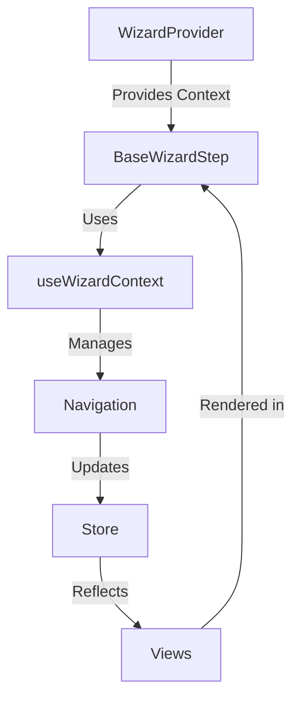
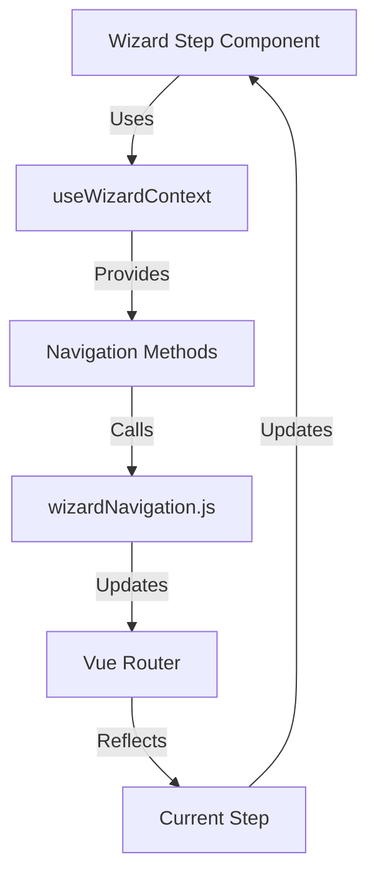

# WizardTeach

AI-powered teaching material generator that creates comprehensive, week-by-week lesson plans through simple teacher inputs.

After a simple onboarding flow, teachers will receive a free lesson plan, which will populate a persistent calendar through our site (They will be required to sign up for free so they can access this calendar whenever they want to prepare for future lessons.)

They will be able to navigate the calendar by week (a scrolling list of weeks with an ai generated title and description as well as 3 tags to describe the week. )

When they click on a week they will go to a page with each day of that week. Each day will have a generated lesson outline, and a menu of buttons to generate classroom materials.

Clicking on a day will bring up a lesson outline meant to be a reference for the teacher while teaching. It will include hyperlinks to all previously generated materials, as well as having a chat bot to make changes on the fly. 

There will be a wizard ai agent in the bottom left corner that a teacher can chat with, you can ask for it to change your week

- Initial wizard flow for course setup
- Standards selection and validation
- Basic lesson plan generation
- Development tools and debugging
</details>

Each day will have a standards check section which explains in depth how that days instruction meets with state or common core standards (would be nice to have an evaluator rubric, but thats complicated and lets not worry about it until later.)

(the two ideas below are far off but possible. Do not worry about them for now)
Another idea is a daily attendance check (can generate a catch up sheet or catch up activities for students who miss days.) 
Another idea is auto grader
## Product Tiers
- **Free:** Basic planning, limited generation, standards tracking
- **Premium ($9.99/mo | $89/yr):** Unlimited generation, custom templates, advanced materials

## System Architecture

### Core Architecture Principles
- **Centralized Navigation**: All navigation managed by `wizardNavigation.js`
- **Decoupled Components**: Steps only emit events, don't handle navigation
- **Single Source of Truth**: Navigation state managed in Pinia store
- **Predictable Flow**: All transitions handled through navigation utilities
- **Debug First**: Built-in debugging and validation tracking

    subgraph "WizardProvider Context"
        A
        B
        C
        D
    end
```

**Flow Explanation:**
1. `OnboardEntry`: Subject selection
2. `CourseDetails`: Course setup (age range, dates, duration)
3. `ChooseStandards`: Educational standards selection
4. `Wizard10Questions`: Teaching preferences
5. `CurriculumWizard`: Content generation
</details>

<details>
<summary><strong>State Management</strong></summary>

### Core State Architecture

Our state management is built using Pinia with a focus on type safety and predictable updates:

```typescript
// stores/wizardStore.js
export const useWizardStore = defineStore('wizard', {
  state: () => ({
    // Navigation State
    currentStep: 0,
    isValid: true,
    
    // Form Data
    subject: '',
    courseDetails: {
      ageRange: '',
      numberOfStudents: null,
      startDate: '',
      endDate: '',
      duration: null
    },
    
    // Standards Selection
    standards: {
      type: '',
      state: '',
      custom: null
    },
    
    // Debug State
    debug: {
      enabled: import.meta.env.DEV,
      showValidation: true,
      showNavigation: true
    }
  }),
  
  getters: {
    canProceed: (state) => state.isValid && state.currentStep < TOTAL_STEPS,
    currentStepComponent: (state) => STEP_COMPONENTS[state.currentStep],
    isComplete: (state) => state.currentStep === TOTAL_STEPS
  },
  
  actions: {
    async validateCurrentStep() {
      const stepValidation = STEP_VALIDATION[this.currentStep];
      this.isValid = await stepValidation(this.$state);
      return this.isValid;
    },
    
    updateStandardsSelection(standards) {
      this.standards = {
        ...this.standards,
        ...standards
      };
    }
  }
});
```

### State Management Principles

1. **Single Source of Truth**
   - All wizard state managed in Pinia store
   - Type-safe state updates
   - Computed properties for derived state

2. **Predictable Updates**
   - Actions for complex state changes
   - Validation before state updates
   - Automatic state persistence

3. **Debug Capabilities**
   - Development-only debug features
   - State change tracking
   - Validation visualization

### Component Integration

```vue
<script setup>
import { useWizardStore } from '@/stores/wizardStore';
import { storeToRefs } from 'pinia';

const store = useWizardStore();
const { currentStep, isValid } = storeToRefs(store);

// Reactive state access
const handleStandardsUpdate = (standards) => {
  store.updateStandardsSelection(standards);
};
</script>
```

### State Persistence

```typescript
// Automatic state persistence configuration
export const useWizardStore = defineStore('wizard', {
  persist: {
    enabled: true,
    strategies: [
      {
        key: 'wizard-progress',
        storage: localStorage,
        paths: ['currentStep', 'subject', 'courseDetails', 'standards']
      }
    ]
  }
  // ... rest of store configuration
});
```

### Best Practices

1. **Type Safety**
   - Use TypeScript for store definitions
   - Define interfaces for state shape
   - Validate state updates

2. **Performance**
   - Use computed properties for derived state
   - Avoid unnecessary state updates
   - Implement proper memoization

3. **Debug Support**
   - Enable Vue Devtools integration
   - Add development-only state
   - Implement state logging

## File Structure
```
src/
├── css/                           # Global styles
│   ├── main.css                  # Theme variables and base styles
│   └── form-controls.css         # Form control styles
│
└── js/
    ├── api/                      # API integrations
    ├── components/
    │   ├── shared/              # Shared components
    │   │   ├── WizardAssistant.vue
    │   │   ├── DebugPanel.vue
    │   │   ├── StateTree.vue
    │   │   ├── TextBoxWithAITag.vue
    │   │   └── GlobalNav.vue
    │   └── wizard/              # Wizard-specific components
    │
    ├── composables/             # Vue composables
    │   ├── useWizardContext.js  # Wizard navigation context
    │   └── useValidation.js     # Form validation utilities
    │
    ├── config/                  # Application configuration
    │   └── theme.js            # Theme configuration
    │
    ├── models/                  # Data models
    │   └── Request.js          # API request models
    │
    ├── router/                  # Routing configuration
    │   ├── index.js            # Main router configuration
    │   └── wizardNavigation.js # Wizard navigation utilities
    │
    ├── stores/                  # State management
    │   └── wizardStore.js      # Wizard state store
    │
    ├── views/
    │   ├── Dashboard.vue       # Main dashboard
    │   ├── MaterialsView.vue   # Materials management
    │   ├── CurriculumWizard.vue # Curriculum generation
    │   └── onboardwizard/      # Onboarding wizard views
    │       ├── WizardProvider.vue  # Context provider
    │       ├── BaseWizardStep.vue  # Base navigation template
    │       ├── OnboardEntry.vue    # Initial entry
    │       ├── CourseDetails.vue   # Course setup
    │       ├── ChooseStandards.vue # Standards selection
    │       ├── Wizard10Questions.vue # Teaching preferences
    │       └── ThinkingStep.vue    # AI processing view
    │
    ├── app.js                  # Application entry
    └── App.vue                 # Root component
```

### Recent Commits

#### 2024-03-19: Wizard Context and Navigation Refactor
- Introduced `WizardProvider.vue` for centralized context management
- Refactored navigation to use composition API with `useWizardContext`
- Enhanced error handling in wizard navigation
- Added `ThinkingStep.vue` for AI processing visualization
- Updated `ChooseStandards.vue` to use new context system

#### 2024-03-18: Component Architecture Updates
- Simplified component communication through context
- Enhanced debug panel with collapsible sections
- Improved theme consistency across wizard components
- Added validation utilities in `useValidation.js`

#### 2024-03-17: State Management Optimization
- Centralized wizard state in Pinia store
- Implemented persistent state with localStorage
- Added type safety improvements
- Enhanced debug visualization

### Navigation Flow (Updated)


## Theme System

### Core Theme Architecture

Our theme system is built on CSS variables with a focus on maintainability and flexibility:

```css
/* css/main.css */
:root {
  /* Color System */
  --primary-50: #eef2ff;
  --primary-100: #e0e7ff;
  --primary-500: #6366f1;
  --primary-600: #4f46e5;
  --primary-700: #4338ca;
  
  --success-500: #22c55e;
  --error-500: #ef4444;
  --warning-500: #f59e0b;
  
  /* Typography */
  --font-sans: 'Inter', system-ui, sans-serif;
  --font-mono: 'Fira Code', monospace;
  
  /* Spacing */
  --space-1: 0.25rem;
  --space-2: 0.5rem;
  --space-4: 1rem;
  --space-8: 2rem;
  
  /* Transitions */
  --transition-fast: 150ms ease-in-out;
  --transition-normal: 250ms ease-in-out;
  
  /* Shadows */
  --shadow-sm: 0 1px 2px 0 rgb(0 0 0 / 0.05);
  --shadow-md: 0 4px 6px -1px rgb(0 0 0 / 0.1);
}

/* Dark Mode Overrides */
@media (prefers-color-scheme: dark) {
  :root {
    --bg-primary: #1a1b1e;
    --bg-secondary: #2c2e33;
    --text-primary: #ffffff;
    --text-secondary: #a1a1aa;
  }
}
```

### Component Theme Integration

```vue
<!-- components/shared/TextBoxWithAITag.vue -->
<template>
  <div class="input-wrapper">
    <input
      :class="[
        'form-input',
        { 'is-valid': isValid },
        { 'is-loading': isLoading }
      ]"
      v-bind="$attrs"
    />
    <AITag v-if="hasAI" />
  </div>
</template>

<style scoped>
.input-wrapper {
  position: relative;
  width: 100%;
}

.form-input {
  width: 100%;
  padding: var(--space-2) var(--space-4);
  font-family: var(--font-sans);
  border: 1px solid var(--border-color);
  border-radius: var(--radius-md);
  transition: var(--transition-fast);
}

.form-input.is-valid {
  border-color: var(--success-500);
}

.form-input.is-loading {
  background-image: linear-gradient(
    90deg,
    var(--bg-secondary) 0%,
    var(--bg-primary) 50%,
    var(--bg-secondary) 100%
  );
  background-size: 200% 100%;
  animation: loading 1.5s infinite;
}

@keyframes loading {
  0% { background-position: 200% 0; }
  100% { background-position: -200% 0; }
}
</style>
```

### Theme Configuration

```typescript
// config/theme.js
export const theme = {
  colors: {
    primary: {
      50: 'var(--primary-50)',
      100: 'var(--primary-100)',
      500: 'var(--primary-500)',
      600: 'var(--primary-600)',
      700: 'var(--primary-700)'
    },
    // ... other color definitions
  },
  
  spacing: {
    1: 'var(--space-1)',
    2: 'var(--space-2)',
    4: 'var(--space-4)',
    8: 'var(--space-8)'
  },
  
  transitions: {
    fast: 'var(--transition-fast)',
    normal: 'var(--transition-normal)'
  }
};
```

### Best Practices

1. **CSS Variable Usage**
   - Use semantic variable names
   - Maintain consistent naming conventions
   - Provide fallback values

2. **Component Styling**
   - Use scoped styles by default
   - Leverage CSS custom properties
   - Implement responsive design

3. **Theme Customization**
   - Support dark mode through media queries
   - Allow component-level overrides
   - Maintain accessibility standards

## WizardAssistant Architecture

The `WizardAssistant` component is a simple, self-contained helper that appears in specific views to guide users.

### Key Features
- **Self-Managed Visibility**: Component decides when to show itself based on the current route
- **Simple Positioning**: Views can override default bottom-right position if needed
- **Contextual Help**: Shows relevant messages based on which view the user is in

### Usage
```vue
<!-- In App.vue - Default bottom-right positioning -->
<WizardAssistant />

<!-- In a specific view - Custom position -->
<WizardAssistant position="bottom-left" />
```

### Adding to New Views
1. Add view name to `WIZARD_ENABLED_VIEWS` in the component
2. Add a message for that view
3. Optionally specify a different position

## Implementation Phases

### Current (Phase 1: Enhanced Local Setup)
- Streamlined teacher input wizard with centralized navigation
- Comprehensive debug system
  - Navigation state tracking
  - Form validation monitoring
  - Field completion status
- Robust state management
  - Centralized store
  - Predictable updates
  - Debug visualization

```typescript
// Enhanced Local Setup Store
interface LocalSetupStore {
  // Navigation State
  navigation: {
    currentStep: number;
    steps: string[];
    isValid: boolean;
  };

  // Form Data
  formData: {
    subject: string;
    studentAgeRange: string;
    numberOfStudents: number;
    startDate: string;
    endDate: string;
    lessonDuration: number;
    standards: {
      selectedType: string;
      state?: string;
      customStandards?: {
        file: File | null;
        status: string | null;
      };
    };
  };

  // Debug Configuration
  debug: {
    isEnabled: boolean;
    panels: {
      navigation: boolean;
      validation: boolean;
      state: boolean;
    };
  };
}
```

### Near-Term (Phase 2: Server Integration)
- Account creation and authentication
- Transfer local setup to server
- Full calendar view with rich week editing
- AI-powered week assistant
- Per-week customization
  - Pacing preferences
  - Assessment frequency
  - Activity types, group based, presentation, independent research, current events(Needs a news plugin through SK - kind of complicated dont worry about it for now)
  - Material preferences
- Global curriculum settings
- Premium features

```typescript
// Server-Side Calendar Store
interface CalendarStore {
  weeks: Week[];
  activeWeek: number | null;
  
  weekCustomization: {
    preferredPacing: 'relaxed' | 'standard' | 'intensive';
    assessmentFrequency: AssessmentConfig;
    activityPreferences: ActivityType[];
    materialTypes: MaterialType[];
    teachingStyle: TeachingStyle;
    technologyAccess: TechnologyConfig;
    focusAreas: FocusArea[];
  };

  editHistory: EditRecord[];
  chatContext: {
    currentWeek: number | null;
    conversationHistory: ChatMessage[];
  };
}

// Store Manager for Local/Server Transition
interface StoreManager {
  migrateToServer: (localData: LocalSetupStore) => Promise<void>;
  syncWithServer: () => Promise<void>;
  handleConnectionLoss: () => void;
}
```

### Future (Phase 3)
- Collaborative editing
- Real-time sync
- Mobile apps
- Advanced AI features

```typescript
interface CollaborationState {
  activeEditors: Editor[];
  pendingChanges: Change[];
  syncStatus: SyncState;
}
```

## Technical Stack
- Vue 3 + Composition API
- Pinia for state management
  - Centralized navigation state
  - Debug capabilities
  - Form validation tracking
- Comprehensive debug system
  - State visualization
  - Navigation tracking
  - Validation monitoring

## Development Process

### Current Focus
1. Maintain centralized navigation
2. Enhance debug capabilities
3. Ensure consistent state management
4. Implement proper validation
5. Prepare for server integration

### Code Quality Guidelines
1. **Navigation**: Use `BaseWizardStep` for all wizard navigation
2. **State Management**: Update store through defined actions
3. **Debugging**: Utilize debug panel for development
4. **Validation**: Implement consistent validation patterns
5. **Components**: Leverage shared components

## User Experience Flow
1. **Phase 1: Local Setup**
   - No account required to start
   - Quick, focused wizard
   - Local data persistence
   - Limited preview capabilities
   - Account creation at generation

2. **Phase 2: Server Features**
   - Full calendar access
   - Rich customization tools
   - AI-assisted refinements
   - Premium feature access

## Security

### Current
- Cloudflare Workers API Gateway
- Edge authentication & authorization
- Rate limiting at edge
- DDoS protection

### Future
- WebSocket security
- Real-time validation
- Enhanced rate limiting
- Collaboration security 

## View Structure

### Base Template
```typescript
// src/js/views/BaseTemplate.vue
interface BaseTemplate {
  header: HeaderComponent;
  navigation: NavigationComponent;
  content: RouterView;
  footer: FooterComponent;
}
```

### Wizard Types
Each wizard type lives in its own directory and follows a consistent pattern:
```
src/js/views/
├── onboardwizard/           # Initial setup wizard
│   ├── CourseDetails.vue    # Basic course information
│   ├── StandardsSelect.vue  # Educational standards
│   └── ReviewGenerate.vue   # Review and generation
│
├── worksheetgenwizard/      # Worksheet generation wizard
│   ├── ContentType.vue      # Worksheet type selection
│   ├── QuestionFormat.vue   # Question structure
│   └── StylePreview.vue     # Visual style selection
│
├── powerpointgenwizard/     # Presentation generation wizard
│   ├── SlideStructure.vue   # Slide organization
│   ├── VisualStyle.vue      # Theme and graphics
│   └── TransitionType.vue   # Animation preferences
│
└── flashcardgenwizard/      # Flashcard generation wizard
    ├── CardFormat.vue       # Card layout selection
    ├── ContentType.vue      # Study material format
    └── ReviewStyle.vue      # Review method selection
```

### Common Components
Shared steps and components across wizards:
```typescript
// Common wizard steps that can be reused
interface CommonWizardSteps {
  OnboardEntry: Component;
  StandardsAlignment: Component;
  MaterialPreview: Component;
  GenerationOptions: Component;
}

// Base wizard step with shared functionality
interface BaseWizardStep {
  isValid: boolean;
  canProceed: boolean;
  validation: ValidationRules;
  navigate: WizardNavigation;
}
```

### Wizard State Management
Each wizard type maintains its own local state until account creation:
```typescript
interface WizardStateManager {
  localState: {
    onboarding: OnboardingState;
    worksheet: WorksheetState;
    powerpoint: PowerPointState;
    flashcard: FlashcardState;
  };
  
  // Common functionality
  persistState(): void;
  restoreState(): void;
  clearState(): void;
  
  // Generation gates
  requiresAccount(): boolean;
  canGenerate(): boolean;
}
``` 

## Navigation & Routing

### Core Navigation Architecture

Our navigation system is built around three key components:

1. **Router Configuration** (`router/index.js`)
```typescript
const routes = [
  {
    path: '/onboard',
    component: () => import('@/views/onboardwizard/BaseWizardStep.vue'),
    children: [
      {
        path: '',
        name: 'OnboardEntry',
        component: () => import('@/views/onboardwizard/OnboardEntry.vue'),
        meta: { step: 0 }
      },
      // ... other wizard steps
    ]
  }
];
```

2. **Wizard Navigation** (`router/wizardNavigation.js`)
```typescript
// Navigation utilities
export const goToNextStep = async () => {
  const currentStep = useWizardContext();
  await validateStep();
  await router.push(getNextRoute());
};

export const goToPreviousStep = async () => {
  await router.push(getPreviousRoute());
};
```

3. **Wizard Context** (`composables/useWizardContext.js`)
```typescript
export const useWizardContext = () => {
  const context = inject(WIZARD_CONTEXT_KEY);
  if (!context) {
    throw new Error('Wizard navigation context not found. Are you using this inside a wizard component?');
  }
  return context;
};
```

### Navigation Flow



### Key Features

1. **Centralized Navigation**
   - All navigation logic centralized in `wizardNavigation.js`
   - Consistent navigation methods across components
   - Built-in validation and error handling

2. **Context Management**
   - Wizard context provided through Vue's provide/inject
   - Type-safe navigation utilities
   - Automatic state synchronization

3. **Component Integration**
```vue
<script setup>
import { useWizardContext } from '@/composables/useWizardContext';

const { goToNextStep, goToPreviousStep } = useWizardContext();

const handleNext = async () => {
  // Component-specific validation
  if (await validate()) {
    await goToNextStep();
  }
};
</script>
```

### Best Practices

1. **Always Use Context**
   - Access navigation through `useWizardContext`
   - Never directly manipulate router
   - Handle navigation errors gracefully

2. **Validation**
   - Validate current step before navigation
   - Use type-safe validation rules
   - Provide clear error messages

3. **State Management**
   - Keep navigation state in store
   - Sync router with store state
   - Use navigation guards for protection

[Rest of sections remain unchanged] 