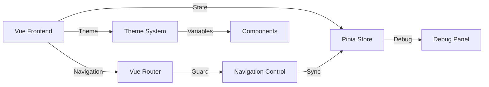
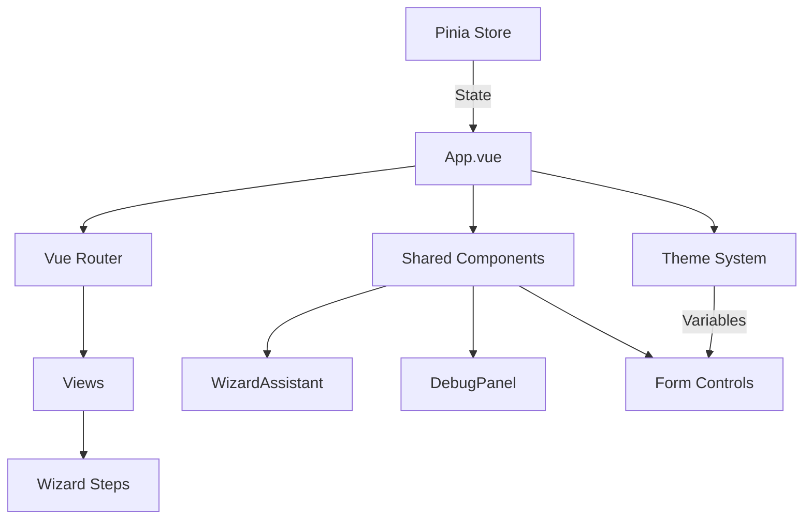

# WizardTeach

AI-powered teaching material generator that creates comprehensive, week-by-week lesson plans through simple teacher inputs.

After a simple onboarding flow, teachers will receive a free lesson plan, which will populate a persistent calendar through our site (They will be required to sign up for free so they can access this calendar whenever they want to prepare for future lessons.)

They will be able to navigate the calendar by week (a scrolling list of weeks with an ai generated title and description as well as 3 tags to describe the week. )

When they click on a week they will go to a page with each day of that week. Each day will have a generated lesson outline, and a menu of buttons to generate classroom materials.

Clicking on a day will bring up a lesson outline meant to be a reference for the teacher while teaching. It will include hyperlinks to all previously generated materials, as well as having a chat bot to make changes on the fly. 

There will be a wizard ai agent in the bottom left corner that a teacher can chat with, you can ask for it to change your week

Basic generation is free (assessments, homework, activities) , advanced generation is in the premium tier (Powerpoints, study guides, flash cards).  

Each day will have a standards check section which explains in depth how that days instruction meets with state or common core standards (would be nice to have an evaluator rubric, but thats complicated and lets not worry about it until later.)

(the two ideas below are far off but possible. Do not worry about them for now)
Another idea is a daily attendance check (can generate a catch up sheet or catch up activities for students who miss days.) 
Another idea is auto grader
## Product Tiers
- **Free:** Basic planning, limited generation, standards tracking
- **Premium ($9.99/mo | $89/yr):** Unlimited generation, custom templates, advanced materials

## System Architecture

### Core Architecture Principles
- **Centralized Navigation**: All wizard step navigation is managed by `BaseWizardStep`
- **State Management**: Pinia store with predictable state updates and debug capabilities
- **Component Reusability**: Shared components for common functionality
- **Self-Contained Components**: Components like `WizardAssistant` manage their own visibility and state
- **Modular Design**: Each component and feature can be easily modified or removed
- **Simple Over Complex**: Favor straightforward implementations unless complexity is justified
- **Theme System**: Consistent theming with CSS variables, with escape hatches for edge cases

### Overall System


### Frontend Architecture


## File Structure
```
src/
├── css/
│   ├── main.css                      # Global styles and theme variables
│   └── form-controls.css             # Form control styles
│
└── js/
    ├── components/
    │   └── shared/                    # Shared components
    │       ├── WizardAssistant.vue    # Self-managed contextual helper
    │       ├── DebugPanel.vue         # Debug interface
    │       ├── StateTree.vue          # State visualization
    │       ├── TextBoxWithAITag.vue   # AI-enabled input
    │       ├── UploadAndHoldFileWithinPinia.vue
    │       ├── BlueDottedOvalShowsCompletedFormFields.vue
    │       └── GlobalNav.vue
    │
    ├── views/
    │   ├── Dashboard.vue
    │   ├── MaterialsView.vue
    │   ├── CurriculumWizard.vue
    │   └── onboardwizard/            # Onboarding wizard views
    │       ├── BaseWizardStep.vue    # Core navigation component
    │       ├── OnboardEntry.vue      # Initial entry point
    │       ├── CourseDetails.vue     # Course setup with form controls
    │       ├── ChooseStandards.vue   # Standards selection
    │       └── Wizard10Questions.vue  # AI-powered questionnaire
    │
    ├── stores/                        # State management
    │   └── store.js
    │
    ├── router/                        # Routing configuration
    │   └── index.js
    │
    ├── config/                        # Application configuration
    │   └── theme.js                   # Theme configuration
    │
    ├── api/                          # API integrations
    ├── models/                       # Data models
    │   └── Request.js
    │
    ├── app.js                        # Application entry
    └── App.vue                       # Root component
```

## Recent Changes

### Latest Commit (2024-03-XX)
**Form Control Styling and Theme System Enhancements**

Changes:
- Enhanced form control styling with consistent placeholder colors
- Added specific styling for number input placeholders in dark mode
- Implemented browser-specific placeholder styles for maximum compatibility
- Updated theme system documentation with edge case handling
- Added CSS variables for consistent theming across components
- Improved accessibility of form controls in dark mode

Files Modified:
- `src/css/form-controls.css`
- `src/js/views/onboardwizard/CourseDetails.vue`
- `README.md`

Key Technical Details:
- Added `.number-students` class for specific input styling
- Implemented cross-browser placeholder color fixes
- Used hardcoded colors (`#E4E6EB`) for consistent dark mode placeholders
- Enhanced theme system documentation with practical examples

## Theme System

### Core Principles
- Use CSS variables for consistent theming
- Maintain dark/light mode compatibility
- Allow component-specific overrides when necessary
- Provide escape hatches for edge cases (e.g., hardcoded colors)

### Implementation
```css
/* Base theme variables */
:root {
  --bg-primary: #ffffff;
  --bg-secondary: #f9fafb;
  --text-primary: #111827;
  --text-secondary: #4b5563;
  --border-color: #e5e7eb;
}

/* Dark mode overrides */
.dark {
  --bg-primary: #18191A;
  --bg-secondary: #242526;
  --text-primary: #E4E6EB;
  --text-secondary: #B0B3B8;
  --border-color: #3A3B3C;
}
```

### Edge Cases
Some components may require direct color values for maximum compatibility:
```css
/* Example: Number input placeholder in CourseDetails.vue */
.wizard-section input[type="number"].form-input.number-students::placeholder {
  color: #E4E6EB !important; /* Hardcoded for consistent appearance */
  opacity: 1 !important;
}
```

## WizardAssistant Architecture

The `WizardAssistant` component is a simple, self-contained helper that appears in specific views to guide users.

### Key Features
- **Self-Managed Visibility**: Component decides when to show itself based on the current route
- **Simple Positioning**: Views can override default bottom-right position if needed
- **Contextual Help**: Shows relevant messages based on which view the user is in

### Usage
```vue
<!-- In App.vue - Default bottom-right positioning -->
<WizardAssistant />

<!-- In a specific view - Custom position -->
<WizardAssistant position="bottom-left" />
```

### Adding to New Views
1. Add view name to `WIZARD_ENABLED_VIEWS` in the component
2. Add a message for that view
3. Optionally specify a different position

## Implementation Phases

### Current (Phase 1: Enhanced Local Setup)
- Streamlined teacher input wizard with centralized navigation
- Comprehensive debug system
  - Navigation state tracking
  - Form validation monitoring
  - Field completion status
- Robust state management
  - Centralized store
  - Predictable updates
  - Debug visualization

```typescript
// Enhanced Local Setup Store
interface LocalSetupStore {
  // Navigation State
  navigation: {
    currentStep: number;
    steps: string[];
    isValid: boolean;
  };

  // Form Data
  formData: {
    subject: string;
    studentAgeRange: string;
    numberOfStudents: number;
    startDate: string;
    endDate: string;
    lessonDuration: number;
    standards: {
      selectedType: string;
      state?: string;
      customStandards?: {
        file: File | null;
        status: string | null;
      };
    };
  };

  // Debug Configuration
  debug: {
    isEnabled: boolean;
    panels: {
      navigation: boolean;
      validation: boolean;
      state: boolean;
    };
  };
}
```

### Near-Term (Phase 2: Server Integration)
- Account creation and authentication
- Transfer local setup to server
- Full calendar view with rich week editing
- AI-powered week assistant
- Per-week customization
  - Pacing preferences
  - Assessment frequency
  - Activity types, group based, presentation, independent research, current events(Needs a news plugin through SK - kind of complicated dont worry about it for now)
  - Material preferences
- Global curriculum settings
- Premium features

```typescript
// Server-Side Calendar Store
interface CalendarStore {
  weeks: Week[];
  activeWeek: number | null;
  
  weekCustomization: {
    preferredPacing: 'relaxed' | 'standard' | 'intensive';
    assessmentFrequency: AssessmentConfig;
    activityPreferences: ActivityType[];
    materialTypes: MaterialType[];
    teachingStyle: TeachingStyle;
    technologyAccess: TechnologyConfig;
    focusAreas: FocusArea[];
  };

  editHistory: EditRecord[];
  chatContext: {
    currentWeek: number | null;
    conversationHistory: ChatMessage[];
  };
}

// Store Manager for Local/Server Transition
interface StoreManager {
  migrateToServer: (localData: LocalSetupStore) => Promise<void>;
  syncWithServer: () => Promise<void>;
  handleConnectionLoss: () => void;
}
```

### Future (Phase 3)
- Collaborative editing
- Real-time sync
- Mobile apps
- Advanced AI features

```typescript
interface CollaborationState {
  activeEditors: Editor[];
  pendingChanges: Change[];
  syncStatus: SyncState;
}
```

## Technical Stack
- Vue 3 + Composition API
- Pinia for state management
  - Centralized navigation state
  - Debug capabilities
  - Form validation tracking
- Comprehensive debug system
  - State visualization
  - Navigation tracking
  - Validation monitoring

## Development Process

### Current Focus
1. Maintain centralized navigation
2. Enhance debug capabilities
3. Ensure consistent state management
4. Implement proper validation
5. Prepare for server integration

### Code Quality Guidelines
1. **Navigation**: Use `BaseWizardStep` for all wizard navigation
2. **State Management**: Update store through defined actions
3. **Debugging**: Utilize debug panel for development
4. **Validation**: Implement consistent validation patterns
5. **Components**: Leverage shared components

## User Experience Flow
1. **Phase 1: Local Setup**
   - No account required to start
   - Quick, focused wizard
   - Local data persistence
   - Limited preview capabilities
   - Account creation at generation

2. **Phase 2: Server Features**
   - Full calendar access
   - Rich customization tools
   - AI-assisted refinements
   - Premium feature access

## Security

### Current
- Cloudflare Workers API Gateway
- Edge authentication & authorization
- Rate limiting at edge
- DDoS protection

### Future
- WebSocket security
- Real-time validation
- Enhanced rate limiting
- Collaboration security 

## View Structure

### Base Template
```typescript
// src/js/views/BaseTemplate.vue
interface BaseTemplate {
  header: HeaderComponent;
  navigation: NavigationComponent;
  content: RouterView;
  footer: FooterComponent;
}
```

### Wizard Types
Each wizard type lives in its own directory and follows a consistent pattern:
```
src/js/views/
├── onboardwizard/           # Initial setup wizard
│   ├── CourseDetails.vue    # Basic course information
│   ├── StandardsSelect.vue  # Educational standards
│   └── ReviewGenerate.vue   # Review and generation
│
├── worksheetgenwizard/      # Worksheet generation wizard
│   ├── ContentType.vue      # Worksheet type selection
│   ├── QuestionFormat.vue   # Question structure
│   └── StylePreview.vue     # Visual style selection
│
├── powerpointgenwizard/     # Presentation generation wizard
│   ├── SlideStructure.vue   # Slide organization
│   ├── VisualStyle.vue      # Theme and graphics
│   └── TransitionType.vue   # Animation preferences
│
└── flashcardgenwizard/      # Flashcard generation wizard
    ├── CardFormat.vue       # Card layout selection
    ├── ContentType.vue      # Study material format
    └── ReviewStyle.vue      # Review method selection
```

### Common Components
Shared steps and components across wizards:
```typescript
// Common wizard steps that can be reused
interface CommonWizardSteps {
  OnboardEntry: Component;
  StandardsAlignment: Component;
  MaterialPreview: Component;
  GenerationOptions: Component;
}

// Base wizard step with shared functionality
interface BaseWizardStep {
  isValid: boolean;
  canProceed: boolean;
  validation: ValidationRules;
  navigate: WizardNavigation;
}
```

### Wizard State Management
Each wizard type maintains its own local state until account creation:
```typescript
interface WizardStateManager {
  localState: {
    onboarding: OnboardingState;
    worksheet: WorksheetState;
    powerpoint: PowerPointState;
    flashcard: FlashcardState;
  };
  
  // Common functionality
  persistState(): void;
  restoreState(): void;
  clearState(): void;
  
  // Generation gates
  requiresAccount(): boolean;
  canGenerate(): boolean;
}
``` 