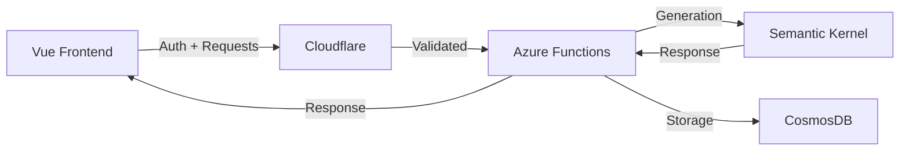
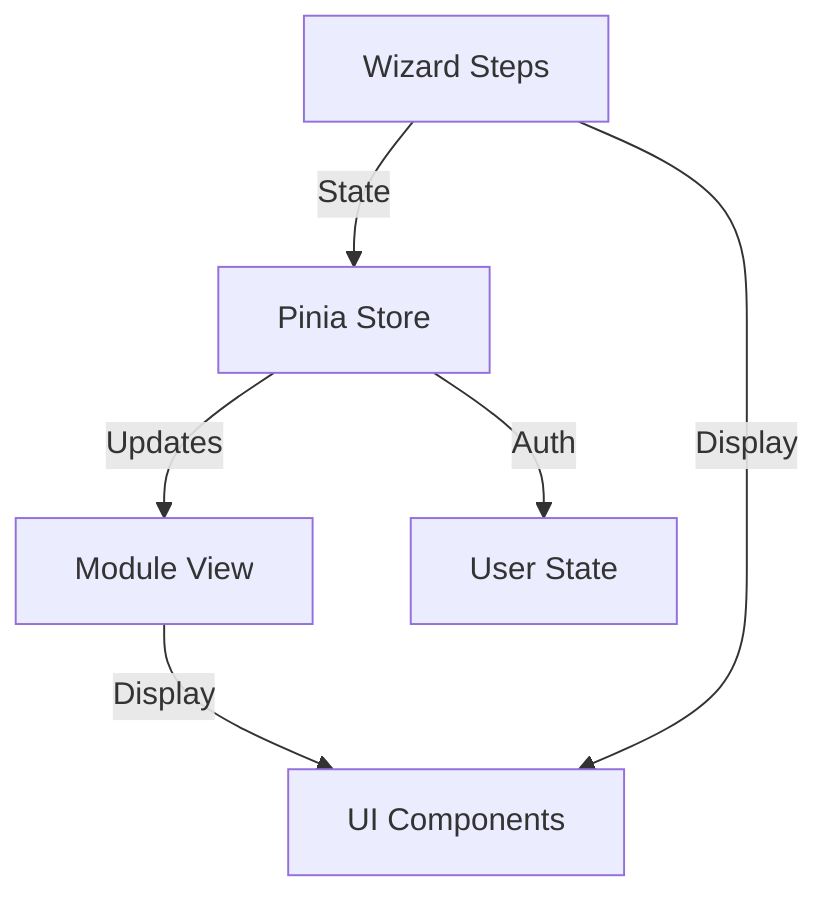
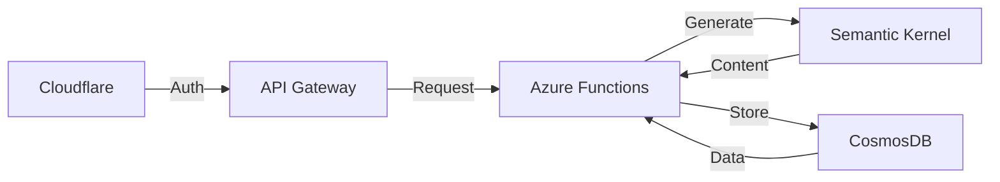

# WizardTeach

AI-powered teaching material generator that creates comprehensive, week-by-week lesson plans through simple teacher inputs.

## System Architecture

### Overall System


### Frontend Architecture


### Backend Architecture


## Current Implementation (Phase 1)

### Core Features
- Teacher input collection
- Basic material generation
- Email signup flow
- Module preview system

### Technical Stack
- Vue 3 + Composition API
- Azure Functions
- Semantic Kernel
- CosmosDB

### Data Models
```typescript
interface GenerationRequest {
  subject: string;
  studentAge: string;
  classSize: number;
  duration: number;
  schedule: Schedule;
  preferences: TeachingPreferences;
}

interface Module {
  id: string;
  weekNumber: number;
  title: string;
  description: string;
  tags: string[];
  materials: DailyMaterials;
}
```

## Near-Term Development (Phase 2)

### Features
- Material system implementation
- User authentication
- Premium features
- Enhanced UI/UX

### State Management
```typescript
interface AppState {
  setup: {
    currentStep: number;
    formData: GenerationRequest;
    validation: ValidationState;
  };
  modules: {
    items: Module[];
    activeModule: string;
  };
  user: {
    auth: AuthState;
    preferences: UserPreferences;
  };
}
```

## Future Extensions (Phase 3)

### Real-time Features
```typescript
interface SyncState {
  userId: string;
  timestamp: number;
  status: 'synced' | 'pending';
  changes: Change[];
}
```

### WebSocket Integration
- Cloudflare WebSocket
- Azure Functions backend
- CosmosDB change feed
- Real-time updates

## Success Metrics

### User Acquisition
- Signup conversion
- Email collection
- Premium upgrades

### Technical Performance
- Generation speed
- System uptime
- Error rates

## Development Process

### Current Focus
1. Complete wizard flow
2. Implement preview
3. Setup email collection
4. Build module view

### Future Roadmap
1. Real-time sync
2. Offline support
3. Collaboration
4. Mobile apps

## Security

### Current
- Cloudflare edge authentication
- Azure Functions authorization
- Rate limiting
- DDoS protection

### Future
- WebSocket security
- Real-time validation
- Enhanced rate limiting
- Collaboration security 