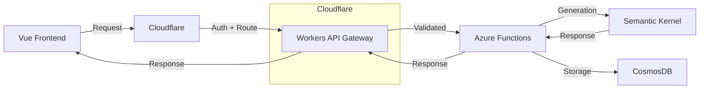
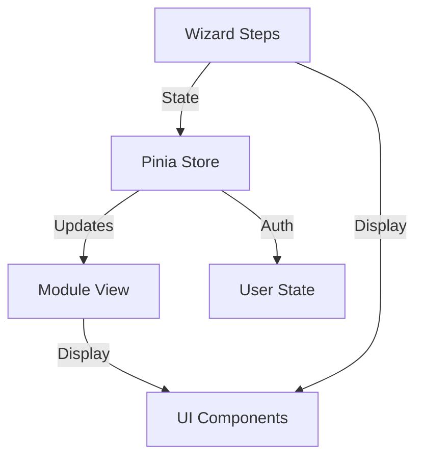
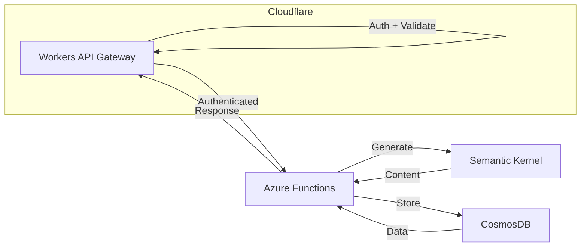

# WizardTeach

AI-powered teaching material generator that creates comprehensive, week-by-week lesson plans through simple teacher inputs.

## Product Tiers
- **Free:** Basic planning, limited generation, standards tracking
- **Premium ($9.99/mo | $89/yr):** Unlimited generation, custom templates, advanced materials

## System Architecture

### Overall System


### Frontend Architecture


### Backend Architecture


## Implementation Phases

### Current (Phase 1)
- Teacher input wizard
- Basic generation
- Email collection
- Module preview
- Core data models

```typescript
interface GenerationRequest {
  subject: string;
  studentAge: string;
  classSize: number;
  duration: number;
  schedule: Schedule;
  preferences: TeachingPreferences;
}

interface Module {
  id: string;
  weekNumber: number;
  title: string;
  description: string;
  tags: string[];
  materials: DailyMaterials;
}
```

### Near-Term (Phase 2)
- Material system
- User accounts
- Premium features
- Enhanced UI/UX

```typescript
interface AppState {
  setup: {
    currentStep: number;
    formData: GenerationRequest;
    validation: ValidationState;
  };
  modules: {
    items: Module[];
    activeModule: string;
  };
  user: {
    auth: AuthState;
    preferences: UserPreferences;
  };
}
```

### Future (Phase 3)
- Real-time sync
- Offline support
- Collaboration
- Mobile apps

```typescript
interface SyncState {
  userId: string;
  timestamp: number;
  status: 'synced' | 'pending';
  changes: Change[];
}
```

## Technical Stack
- Vue 3 + Composition API
- Cloudflare Workers
- Azure Functions
- Semantic Kernel
- CosmosDB

## Security & Performance
- Edge authentication & rate limiting
- DDoS protection
- Generation speed optimization
- Real-time validation (future)
- Collaboration security (future)

## Success Metrics
- Conversion: Signup rate, premium upgrades
- Usage: Generation volume, material access
- Technical: Response times, uptime, error rates

## Development Process

### Current Focus
1. Complete wizard flow
2. Implement preview
3. Setup email collection
4. Build module view

### Future Roadmap
1. Real-time sync
2. Offline support
3. Collaboration
4. Mobile apps

## Security

### Current
- Cloudflare Workers API Gateway
- Edge authentication & authorization
- Rate limiting at edge
- DDoS protection

### Future
- WebSocket security
- Real-time validation
- Enhanced rate limiting
- Collaboration security 