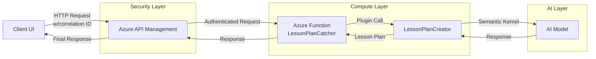

# Lesson Plan Generator Architecture

## Overview
The Lesson Plan Generator is a microservice-based system that leverages Azure's cloud infrastructure to generate detailed lesson plans using AI. The system uses Azure API Management for frontend security, Azure Functions for serverless compute, and Semantic Kernel for AI interaction.

## System Components

### Architecture Diagram



## Component Details

### 1. Client/UI Layer
- Generates unique correlation IDs for request tracking
- Specifies request type for backend handling
- Bundles lesson plan parameters into structured requests
- Makes authenticated calls to APIM endpoint

### 2. Azure API Management (Security Layer)
**Responsibilities:**
- Authentication and authorization
- Rate limiting
- Request validation
- Request/response logging
- API versioning
- Correlation ID tracking
- Traffic management

### 3. Azure Function - LessonPlanCatcher (Compute Layer)
**Responsibilities:**
- Receives pre-validated requests from APIM
- Processes request type
- Instantiates and calls LessonPlanCreator plugin
- Handles error management
- Returns structured responses

### 4. LessonPlanCreator Plugin (AI Layer)
**Responsibilities:**
- Manages Semantic Kernel instance
- Processes lesson plan parameters
- Generates AI prompts
- Returns formatted lesson plans

## Request Flow
1. UI generates request with correlation ID and parameters
2. Request hits APIM
   - Authentication check
   - Rate limiting check
   - Request validation
3. APIM forwards to Azure Function
4. Function processes request and calls plugin
5. Plugin generates lesson plan via Semantic Kernel
6. Response flows back through the same path

## Data Structures

### Request Format
```json
{
    "correlationId": "string",
    "requestType": "string",
    "parameters": {
        "subject": "string",
        "studentAgeRange": "string",
        "numberOfStudents": "integer",
        "specialConsiderations": "string",
        "classDuration": "integer",
        "classDays": "string",
        "standardsType": "string",
        "collaborativeLearning": "boolean",
        "presentationSkills": "boolean",
        "classDiscussions": "boolean",
        "researchSkills": "boolean",
        "testPrep": "string",
        "funFridays": "boolean"
    }
}
```

## Error Handling
- APIM handles authentication and rate limiting errors
- Azure Function handles business logic errors
- All errors maintain correlation ID for tracing
- Structured error responses include:
  - Error code
  - Error message
  - Correlation ID
  - Timestamp

## Monitoring and Logging
- APIM provides request/response logging
- Azure Function logs via Application Insights
- Correlation IDs enable cross-component tracing
- Metrics available for:
  - Request rates
  - Error rates
  - Response times
  - Rate limiting events

## Security Considerations
- All requests must be authenticated via APIM
- Rate limiting prevents abuse
- Correlation IDs for audit trails
- Secure communication between components
- No direct access to Azure Function endpoint

## Future Considerations
- Caching layer for frequent requests
- Multiple AI model support
- Enhanced error handling
- Request/response validation
- API versioning strategy